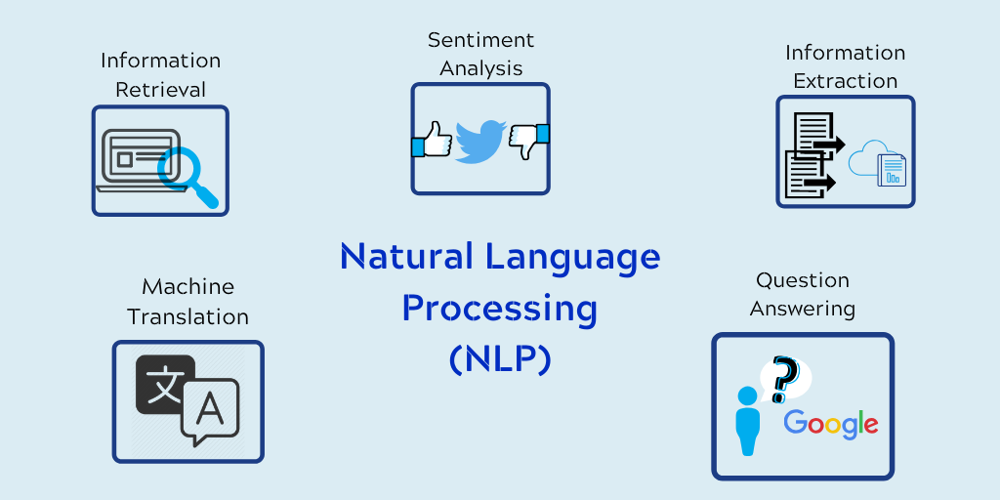

# Natural-Language-Processing
 In this repository I will go through the NLP in details... It will be update in future...
 
 
 
 
 !----------------------------------------------------------------
 - Usefull Links
   - [Check to see if any characters in each string are blank](https://pandas.pydata.org/pandas-docs/stable/reference/api/pandas.Series.str.isspace.html)
